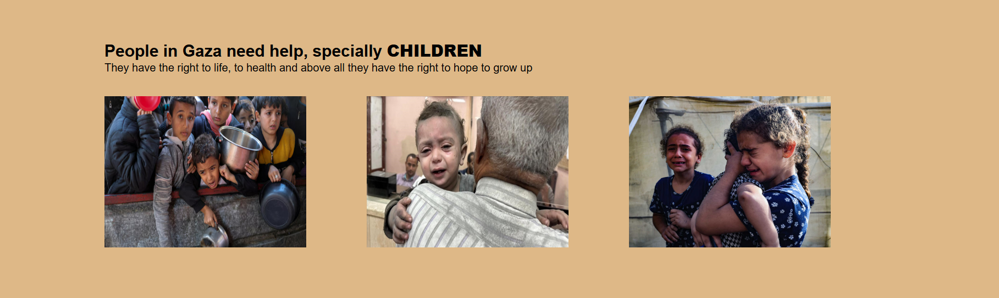

# SBA_307_HTML-and-CSS
[link to my GitHub account](https://github.com/MamelAlbouryNdiaye/SBA_307_HTML-and-CSS)

**_` Introduction :`_**
This project contains four pages made with HTML and CSS. Its goal is to inform and share the pain of vulnerable people, especially those in Gaza. We try to empathize with their suffering.
The first page is located at /index.html.

All The pages have the navbar.

**_` News page :`_**
Allows people to Submit a News Article.
Users submit news they've read online, with a title, link, and short description.
Later, they can manually or automatically add it to your dropdown "Palestine news".

**_` About page :`_**

This page explain the purpose of the website, the mission or motivation behind the site.

**_` Support page :`_**

This section allows you to list organizations that work in the humanitarian field. You can add NGOs if you know any. But to respect the requirements of the subject, we limit ourselves to the static display without using nodejs because HTML and CSS cannot save data dynamically.

